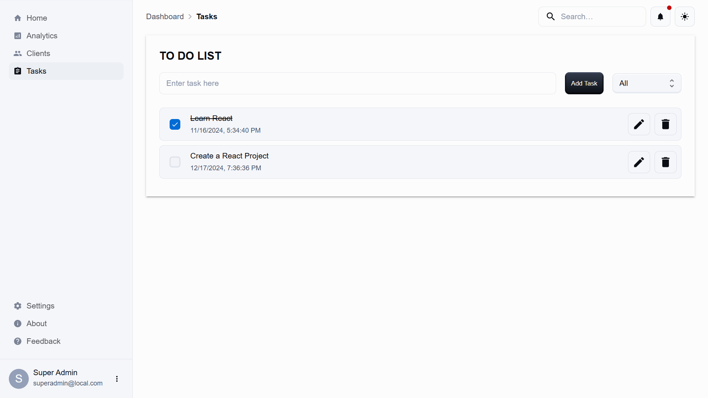
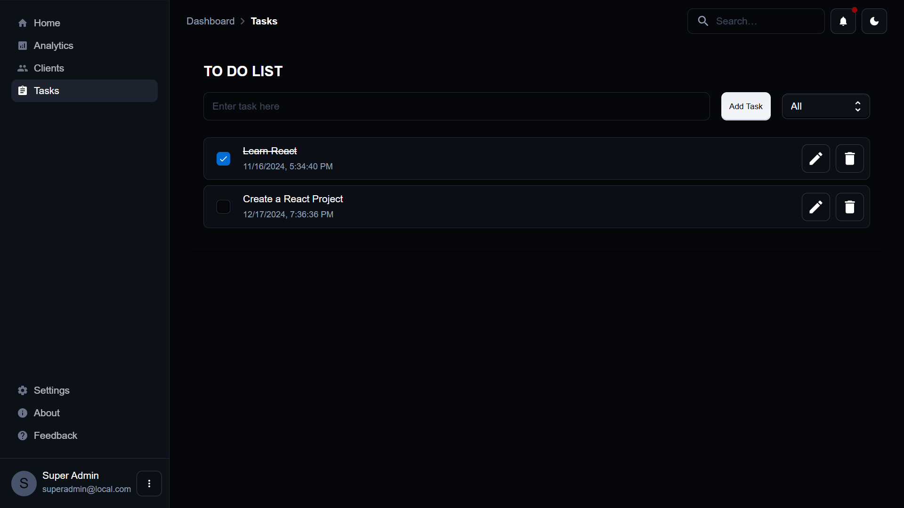

# React and Node.js App

A full-stack application built with React (frontend) and Node.js (backend) to manage tasks.

## Features

### Task Management (To-Do List)

- **Task Creation**: Add new tasks to the to-do list with details like description and timestamp.
- **Task Filtering**: Filter tasks by their status (e.g., All, Completed, Incomplete).
- **Task Completion**: Toggle the completion status of tasks.
- **Task Deletion**: Remove tasks from the list.

## Screenshots

## Future Enhancements

- **User Authentication**: Add user login and registration.
- **Testing**: Add unit and integration tests.
